# DevSecOps pipeline for the Netflix clone
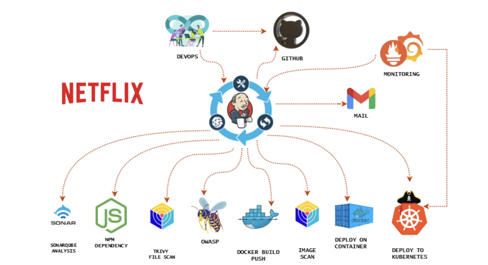

## Problems This Project Solves

This project addresses several key challenges faced in modern software development and deployment:

1. **Automated Deployment**: The project automates the process of deploying a Netflix clone application to the cloud, reducing manual intervention and human error.
2. **Scalability**: By deploying the application in a containerized environment and later moving to a Kubernetes cluster, the project ensures the application can easily scale to handle increased traffic.
3. **Security**: Through the integration of SonarQube and Trivy, the project embeds security checks into the CI/CD pipeline, ensuring that vulnerabilities are identified and addressed before deployment.
4. **Continuous Integration and Delivery**: The Jenkins pipeline enables continuous integration and delivery (CI/CD), allowing for frequent and reliable code deployments with minimal downtime.
5. **Infrastructure Monitoring**: The use of Prometheus and Grafana for monitoring ensures that the infrastructure's health is continuously tracked, with alerts set up to notify of any potential issues, ensuring high availability.

## What This Project Learns

This project provides hands-on experience with deploying a scalable, secure, and monitored web application in a cloud environment using DevSecOps practices. Through this project, participants will learn:

1. **Cloud Infrastructure Management**: Provisioning and managing AWS EC2 instances with Ubuntu 22.04 to host applications.
2. **Containerization with Docker**: Building and running applications inside Docker containers, providing isolated environments that simplify deployment and scalability.
3. **CI/CD Automation with Jenkins**: Setting up Jenkins pipelines to automate the entire deployment process, including code integration, testing, and deployment.
4. **Security and Vulnerability Scanning**: Integrating security tools like SonarQube and Trivy into the CI/CD pipeline to automatically scan code and Docker images for vulnerabilities.
5. **Monitoring and Alerting**: Implementing monitoring solutions using Prometheus and Grafana to visualize application performance and set up alerts for potential issues.
6. **Kubernetes Management**: Deploying applications in a Kubernetes cluster, managing node groups, and using Helm for system-level monitoring.
7. **Notification and Incident Management**: Configuring notification services to alert the team in case of failures or issues in the deployment process.


### **Phase 1: Initial Setup and Deployment**

**Step 1: Launch EC2 (Ubuntu 22.04):**

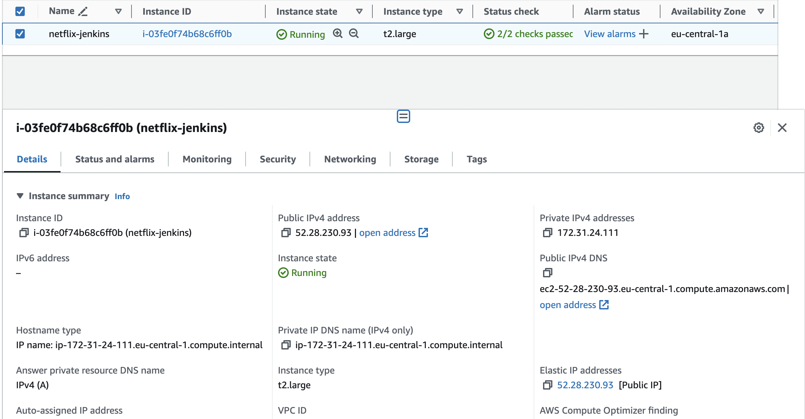

- Provision an EC2 instance on AWS with Ubuntu 22.04.
- Connect to the instance using SSH.

**Step 2: Clone the Code:**

- Update all the packages and then clone the code.
- Clone your application's code repository onto the EC2 instance:
    
    ```bash
    git clone https://github.com/N4si/DevSecOps-Project.git
    ```
    

**Step 3: Install Docker and Run the App Using a Container:**

- Set up Docker on the EC2 instance:
    
    ```bash
    
    sudo apt-get update
    sudo apt-get install docker.io -y
    sudo usermod -aG docker $USER  # Replace with your system's username, e.g., 'ubuntu'
    newgrp docker
    sudo chmod 777 /var/run/docker.sock
    ```
    
- Build and run your application using Docker containers:
    
    ```bash
    docker build -t netflix .
    docker run -d --name netflix -p 8081:80 netflix:latest
    
    #to delete
    docker stop <containerid>
    docker rmi -f netflix
    ```

It will show an error cause you need API key:


**Step 4: Get the API Key:**

- Open a web browser and navigate to TMDB (The Movie Database) website.
- Click on "Login" and create an account.
- Once logged in, go to your profile and select "Settings."
- Click on "API" from the left-side panel.
- Create a new API key by clicking "Create" and accepting the terms and conditions.
- Provide the required basic details and click "Submit."
- You will receive your TMDB API key.

Now recreate the Docker image with your api key:
```
docker build --build-arg TMDB_V3_API_KEY=<your-api-key> -t netflix .
```
And run a container and get:


**Phase 2: Security**

1. **Install SonarQube and Trivy:**
    - Install SonarQube and Trivy on the EC2 instance to scan for vulnerabilities.
        
        sonarqube
        ```
        docker run -d --name sonar -p 9000:9000 sonarqube:lts-community
        ```
        
        
        To access: 
        
        publicIP:9000 (by default username & password is admin)
        
        To install Trivy:
        ```
        sudo apt-get install wget apt-transport-https gnupg lsb-release
        wget -qO - https://aquasecurity.github.io/trivy-repo/deb/public.key | sudo apt-key add -
        echo deb https://aquasecurity.github.io/trivy-repo/deb $(lsb_release -sc) main | sudo tee -a /etc/apt/sources.list.d/trivy.list
        sudo apt-get update
        sudo apt-get install trivy        
        ```
        
        to scan image using trivy
        ```
        trivy image <imageid>
        ```
        
        
2. **Integrate SonarQube and Configure:**
    - Integrate SonarQube with your CI/CD pipeline.
    - Configure SonarQube to analyze code for quality and security issues.      
        

**Phase 3: CI/CD Setup**

1. **Install Jenkins for Automation:**
    - Install Jenkins on the EC2 instance to automate deployment:
    Install Java
    
    ```bash
    sudo apt update
    sudo apt install fontconfig openjdk-17-jre
    java -version
    openjdk version "17.0.8" 2023-07-18
    OpenJDK Runtime Environment (build 17.0.8+7-Debian-1deb12u1)
    OpenJDK 64-Bit Server VM (build 17.0.8+7-Debian-1deb12u1, mixed mode, sharing)
    
    #jenkins
    sudo wget -O /usr/share/keyrings/jenkins-keyring.asc \
    https://pkg.jenkins.io/debian-stable/jenkins.io-2023.key
    echo deb [signed-by=/usr/share/keyrings/jenkins-keyring.asc] \
    https://pkg.jenkins.io/debian-stable binary/ | sudo tee \
    /etc/apt/sources.list.d/jenkins.list > /dev/null
    sudo apt-get update
    sudo apt-get install jenkins
    sudo systemctl start jenkins
    sudo systemctl enable jenkins
    ```
    
    - Access Jenkins in a web browser using the public IP of your EC2 instance.
        
        publicIp:8080
        
2. **Install Necessary Plugins in Jenkins:**

Goto Manage Jenkins →Plugins → Available Plugins →

Install below plugins

1 Eclipse Temurin Installer (Install without restart)

2 SonarQube Scanner (Install without restart)

3 NodeJs Plugin (Install Without restart)

4 Email Extension Plugin

### **Configure Java and Nodejs in Global Tool Configuration**

Goto Manage Jenkins → Tools → Install JDK(17) and NodeJs(16)→ Click on Apply and Save


### SonarQube

Create the token

Goto Jenkins Dashboard → Manage Jenkins → Credentials → Add Secret Text. It should look like this


After adding sonar token

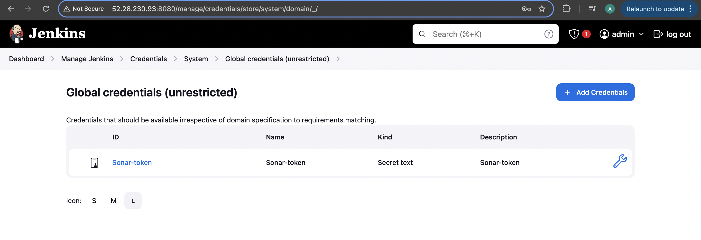

Click on Apply and Save

**The Configure System option** is used in Jenkins to configure different server

**Global Tool Configuration** is used to configure different tools that we install using Plugins

We will install a sonar scanner in the tools.
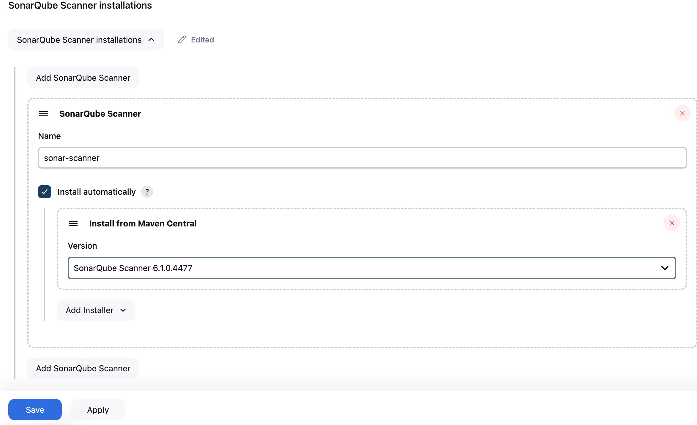

Create a Jenkins webhook

1. **Configure CI/CD Pipeline in Jenkins:**
- Create a CI/CD pipeline in Jenkins to automate your application deployment.

```groovy
pipeline {
    agent any
    tools {
        jdk 'jdk17'
        nodejs 'node16'
    }
    environment {
        SCANNER_HOME = tool 'sonar-scanner'
    }
    stages {
        stage('clean workspace') {
            steps {
                cleanWs()
            }
        }
        stage('Checkout from Git') {
            steps {
                git branch: 'main', url: 'https://github.com/N4si/DevSecOps-Project.git'
            }
        }
        stage("Sonarqube Analysis") {
            steps {
                withSonarQubeEnv('sonar-server') {
                    sh '''$SCANNER_HOME/bin/sonar-scanner -Dsonar.projectName=Netflix \
                    -Dsonar.projectKey=Netflix'''
                }
            }
        }
        stage("quality gate") {
            steps {
                script {
                    waitForQualityGate abortPipeline: false, credentialsId: 'Sonar-token'
                }
            }
        }
        stage('Install Dependencies') {
            steps {
                sh "npm install"
            }
        }
    }
}
```

Sonar scan has passed:
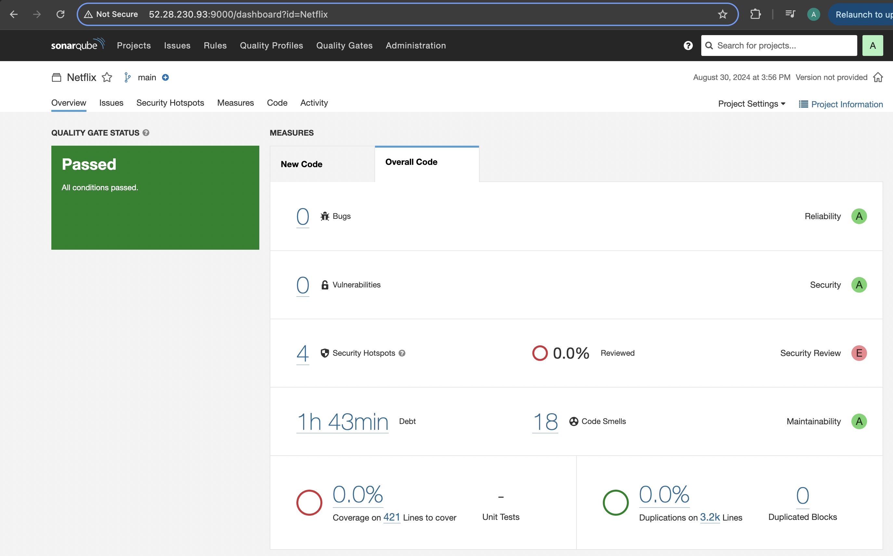

Certainly, here are the instructions without step numbers:

**Install Dependency-Check and Docker Tools in Jenkins**

**Install Dependency-Check Plugin:**

- Go to "Dashboard" in your Jenkins web interface.
- Navigate to "Manage Jenkins" → "Manage Plugins."
- Click on the "Available" tab and search for "OWASP Dependency-Check."
- Check the checkbox for "OWASP Dependency-Check" and click on the "Install without restart" button.

**Configure Dependency-Check Tool:**

- After installing the Dependency-Check plugin, you need to configure the tool.
- Go to "Dashboard" → "Manage Jenkins" → "Global Tool Configuration."
- Find the section for "OWASP Dependency-Check."
- Add the tool's name, e.g., "DP-Check."
- Save your settings.

**Install Docker Tools and Docker Plugins:**

- Go to "Dashboard" in your Jenkins web interface.
- Navigate to "Manage Jenkins" → "Manage Plugins."
- Click on the "Available" tab and search for "Docker."
- Check the following Docker-related plugins:
  - Docker
  - Docker Commons
  - Docker Pipeline
  - Docker API
  - docker-build-step
- Click on the "Install without restart" button to install these plugins.

**Add DockerHub Credentials:**

- To securely handle DockerHub credentials in your Jenkins pipeline, follow these steps:
  - Go to "Dashboard" → "Manage Jenkins" → "Manage Credentials."
  - Click on "System" and then "Global credentials (unrestricted)."
  - Click on "Add Credentials" on the left side.
  - Choose "Secret text" as the kind of credentials.
  - Enter your DockerHub credentials (Username and Password) and give the credentials an ID (e.g., "docker").
  - Click "OK" to save your DockerHub credentials.
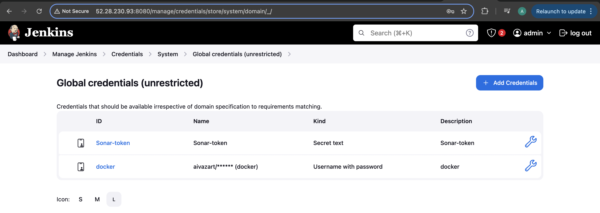

Config Docker Installations:
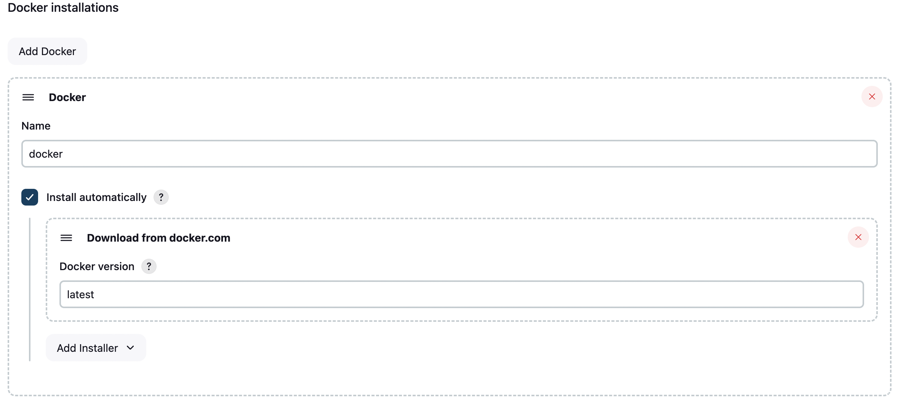

Config Dependecy Check:
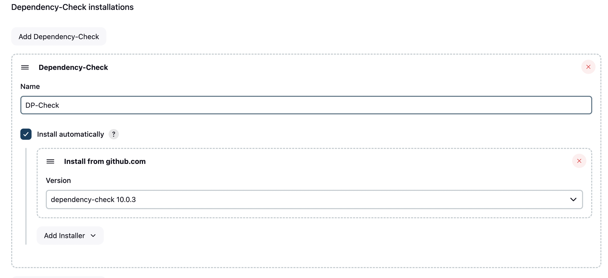

Now, you have installed the Dependency-Check plugin, configured the tool, and added Docker-related plugins along with your DockerHub credentials in Jenkins. You can now proceed with configuring your Jenkins pipeline to include these tools and credentials in your CI/CD process.

```groovy

pipeline{
    agent any
    tools{
        jdk 'jdk17'
        nodejs 'node16'
    }
    environment {
        SCANNER_HOME=tool 'sonar-scanner'
    }
    stages {
        stage('clean workspace'){
            steps{
                cleanWs()
            }
        }
        stage('Checkout from Git'){
            steps{
                git branch: 'main', url: 'https://github.com/N4si/DevSecOps-Project.git'
            }
        }
        stage("Sonarqube Analysis "){
            steps{
                withSonarQubeEnv('sonar-server') {
                    sh ''' $SCANNER_HOME/bin/sonar-scanner -Dsonar.projectName=Netflix \
                    -Dsonar.projectKey=Netflix '''
                }
            }
        }
        stage("quality gate"){
           steps {
                script {
                    waitForQualityGate abortPipeline: false, credentialsId: 'Sonar-token' 
                }
            } 
        }
        stage('Install Dependencies') {
            steps {
                sh "npm install"
            }
        }
        stage('OWASP FS SCAN') {
            steps {
                dependencyCheck additionalArguments: '--scan ./ --disableYarnAudit --disableNodeAudit', odcInstallation: 'DP-Check'
                dependencyCheckPublisher pattern: '**/dependency-check-report.xml'
            }
        }
        stage('TRIVY FS SCAN') {
            steps {
                sh "trivy fs . > trivyfs.txt"
            }
        }
        stage("Docker Build & Push"){
            steps{
                script{
                   withDockerRegistry(credentialsId: 'docker', toolName: 'docker'){   
                       sh "docker build --build-arg TMDB_V3_API_KEY=<yourapikey> -t netflix ."
                       sh "docker tag netflix <yourdockerusername>/netflix:latest "
                       sh "docker push <yourdockerusername>/netflix:latest "
                    }
                }
            }
        }
        stage("TRIVY"){
            steps{
                sh "trivy image <yourdockerusername>/netflix:latest > trivyimage.txt" 
            }
        }
        stage('Deploy to container'){
            steps{
                sh 'docker run -d --name netflix -p 8081:80 <yourdockerusername>/netflix:latest'
            }
        }
    }
}
```

If you get docker login failed error
``` bash
sudo su
sudo usermod -aG docker jenkins
sudo systemctl restart jenkins
```
Result of the Jenkins pipeline:
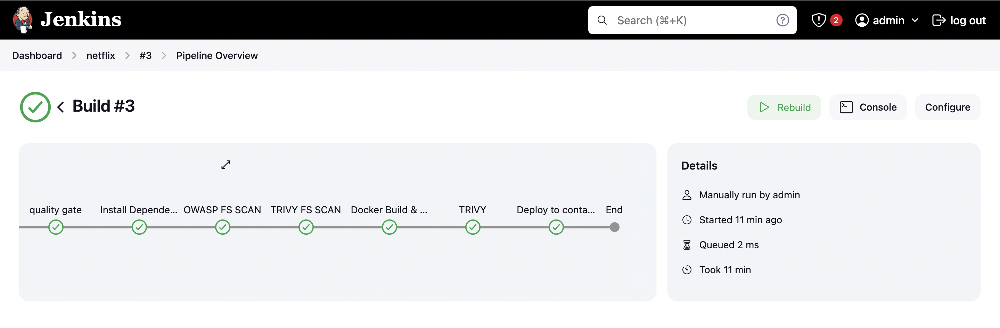

Now check if container is running:
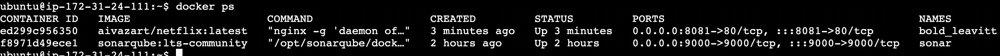

And if image has been pushed to the DockerHub:
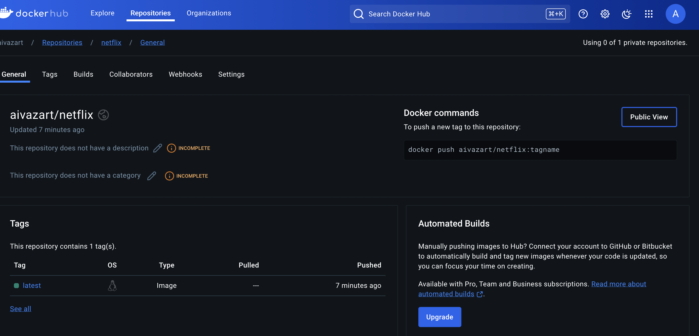

